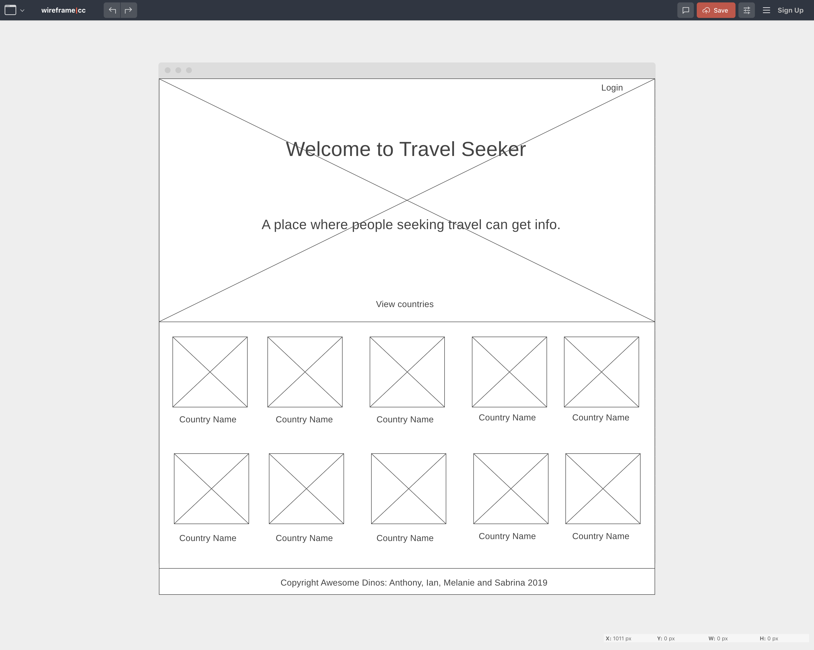
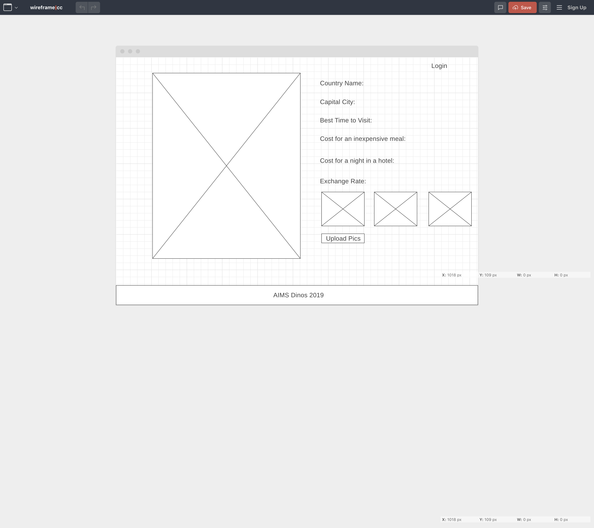
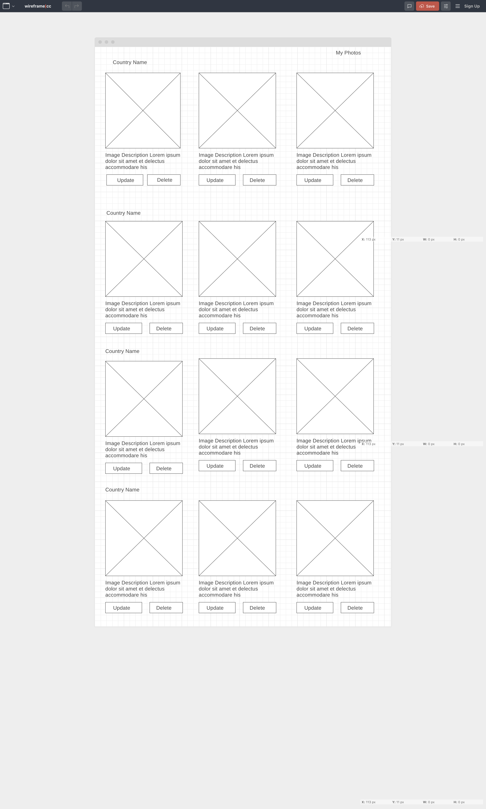

## Project 3 - SEI Collaboration

To help travellers find affordable and fun places to visit.  And share their travel experiences from a curated list of countries

## Features

**MVP:**

1. List of 10 countries based on affordability.  Details are stored in a PostgreSQL DB and exposed as an API using Express
2. Users can add photos of their experiences. A user must log in to add photos
3. Homepage will show a list of all countries
4. Clicking on a specific country will show attributes such as exchange rate, best time to visit, cost of an inexpensive meal, cost of a night at a hostel, and capital city

**Post-MVP:**
1. For each country's show page, have information about 2-3 of the nation's most famous sites or activities to visit. 
2. Have an approval process for user submitted photos.
3. Add weather information for a popular location in each country.

## Technologies: REACT, HTML, CSS, AJAX
API used: 

## Wireframe
### Index Page

### Show Page

### User Page

## Our Journey

## Stretch Goals

